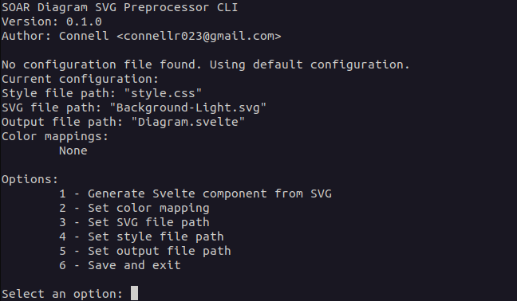
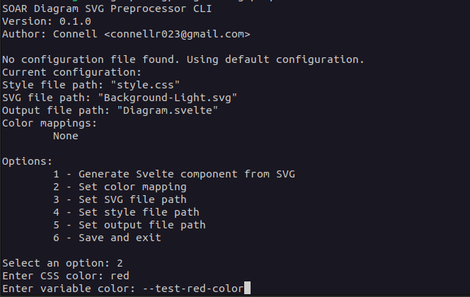
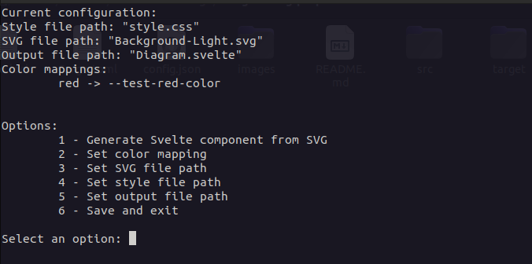
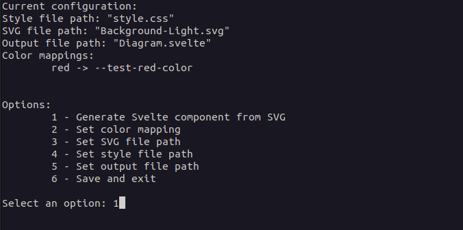

# svg2svelte

> A CLI preprocessor for the SOAR Svelte GUI diagram component.

### Problem this solves

The Svelte GUI diagram component requires dynamic CSS variables in order to allow for programatic customization of theme switching. This CLI tool allows for the conversion of SVG files to Svelte components with dynamic CSS variables.

### How to use

Above is the initial view of the CLI tool.

Above is the view of the color mapping entry. This is where you can map the colors in the SVG file to the dynamic CSS variables.

Above is the view of the color mapping result. As you can see, the arrow indicates that the color mapping was successful.

Above is showing the user enter `1` to generate the Svelte component.

From here, `Diagram.svelte` will be generated in the same directory as the SVG file (since that is the specified output path).

### Making it work with RocketControlUnitGUI

It is essential that every color used in the SVG exported from Figma is mapped to a dynamic CSS variable. This is because the Svelte component requires these dynamic CSS variables to allow for programatic customization of theme switching.

Once the Svelte component is generated, it can replace the existing `Diagram.svelte` file in the `RocketControlUnitGUI` project.

 

    Developed and tested by <b>@connellr023</b>

